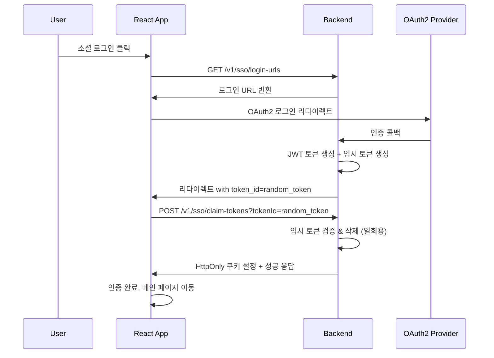

# React SSO 통합 가이드 v2 (개선된 임시 토큰 방식)

## 🎯 개요

이 가이드는 **보안이 강화된 임시 토큰 방식**을 사용하여 React + Vite 환경에서 VibeList Backend의 SSO 기능을 통합하는 방법을 설명합니다.

## 🔐 보안 개선사항

### ❌ 기존 방식의 문제점
1. **JavaScript 접근 가능한 토큰**: XSS 공격에 취약
2. **복잡한 토큰 관리**: 여러 저장 방식을 동시 사용
3. **브라우저 정책 의존**: 쿠키 정책에 따른 불안정성

### ✅ 새로운 임시 토큰 방식
1. **임시 토큰 발급**: OAuth2 완료 시 안전한 랜덤 토큰 생성
2. **일회용 클레임**: 임시 토큰으로 실제 JWT 토큰 획득
3. **HttpOnly 쿠키**: 실제 토큰은 JavaScript 접근 불가
4. **자동 만료**: 5분 후 임시 토큰 자동 삭제

## 🚀 플로우 개요



---

## 백엔드 API 엔드포인트

| HTTP Method | 엔드포인트 | 설명 | 응답 타입 |
|------------|-----------|------|----------|
| `GET` | `/v1/sso/login-urls` | 소셜 로그인 URL 목록 조회 | `Map<String, String>` |
| `GET` | `/v1/sso/status` | 인증 상태 확인 | `SSOStatusResponse` |
| `POST` | `/v1/sso/claim-tokens` | **임시 토큰으로 JWT 클레임** | `Map<String, Object>` |
| `POST` | `/v1/sso/refresh` | 토큰 갱신 | `Map<String, String>` |
| `POST` | `/v1/sso/logout` | 로그아웃 | `Map<String, String>` |

---

## React 프로젝트 설정

### 1. 프로젝트 생성 및 의존성 설치

```bash
# Vite로 React 프로젝트 생성
npm create vite@latest my-vibelist-app -- --template react-ts
cd my-vibelist-app

# 필요한 의존성 설치
npm install axios react-router-dom
npm install -D @types/node

# 개발 서버 실행
npm run dev
```

### 2. 환경변수 설정

#### `.env.development`
```env
# 개발환경 설정
VITE_API_BASE_URL=http://localhost:8080
VITE_APP_BASE_URL=http://localhost:3000
```

### 3. API 클라이언트 설정

#### `src/services/api.ts`
```typescript
import axios from 'axios';

const API_BASE_URL = import.meta.env.VITE_API_BASE_URL || 'http://localhost:8080';

// Axios 인스턴스 생성
export const apiClient = axios.create({
  baseURL: API_BASE_URL,
  timeout: 10000,
  withCredentials: true, // HttpOnly 쿠키 사용을 위해 필수
  headers: {
    'Content-Type': 'application/json',
  },
});

// 요청 인터셉터
apiClient.interceptors.request.use(
  (config) => {
    console.log('🚀 API 요청:', config.method?.toUpperCase(), config.url);
    return config;
  },
  (error) => {
    console.error('❌ API 요청 에러:', error);
    return Promise.reject(error);
  }
);

// 응답 인터셉터 (토큰 만료 처리)
apiClient.interceptors.response.use(
  (response) => {
    console.log('✅ API 응답:', response.status, response.config.url);
    return response;
  },
  async (error) => {
    const originalRequest = error.config;
    
    if (error.response?.status === 401 && !originalRequest._retry) {
      originalRequest._retry = true;
      
      try {
        // 토큰 갱신 시도
        await apiClient.post('/v1/sso/refresh');
        
        // 갱신 성공 시 원래 요청 재시도
        return apiClient(originalRequest);
      } catch (refreshError) {
        console.error('토큰 갱신 실패:', refreshError);
        // 로그인 페이지로 리다이렉트
        window.location.href = '/login';
      }
    }
    
    console.error('❌ API 응답 에러:', error.response?.status, error.response?.data);
    return Promise.reject(error);
  }
);

// SSO 서비스
export const ssoService = {
  /**
   * 소셜 로그인 URL 목록 조회
   */
  async getLoginUrls(redirectUrl?: string): Promise<Record<string, string>> {
    const params = redirectUrl ? { redirectUrl } : {};
    const response = await apiClient.get('/v1/sso/login-urls', { params });
    return response.data;
  },

  /**
   * 임시 토큰으로 실제 JWT 토큰 클레임
   */
  async claimTokens(tokenId: string): Promise<{
    status: string;
    message: string;
    provider?: string;
    isNewUser?: boolean;
    tempUserId?: string;
  }> {
    const response = await apiClient.post('/v1/sso/claim-tokens', null, {
      params: { tokenId }
    });
    return response.data;
  },

  /**
   * 인증 상태 확인
   */
  async getStatus(): Promise<{
    authenticated: boolean;
    userId?: number;
    username?: string;
    email?: string;
    name?: string;
  }> {
    const response = await apiClient.get('/v1/sso/status');
    return response.data;
  },

  /**
   * 토큰 갱신
   */
  async refreshToken(): Promise<{ status: string; message: string }> {
    const response = await apiClient.post('/v1/sso/refresh');
    return response.data;
  },

  /**
   * 로그아웃
   */
  async logout(): Promise<{ status: string; message: string }> {
    const response = await apiClient.post('/v1/sso/logout');
    return response.data;
  },
};
```

### 4. 인증 콘텍스트

#### `src/contexts/AuthContext.tsx`
```typescript
import React, { createContext, useContext, useEffect, useState } from 'react';
import { ssoService } from '../services/api';

interface User {
  id: number;
  username: string;
  email: string;
  name: string;
}

interface AuthContextType {
  user: User | null;
  isAuthenticated: boolean;
  isLoading: boolean;
  login: (provider: string) => void;
  logout: () => Promise<void>;
  checkAuthStatus: () => Promise<void>;
}

const AuthContext = createContext<AuthContextType | undefined>(undefined);

export const useAuth = () => {
  const context = useContext(AuthContext);
  if (context === undefined) {
    throw new Error('useAuth must be used within an AuthProvider');
  }
  return context;
};

export const AuthProvider: React.FC<{ children: React.ReactNode }> = ({ children }) => {
  const [user, setUser] = useState<User | null>(null);
  const [isAuthenticated, setIsAuthenticated] = useState(false);
  const [isLoading, setIsLoading] = useState(true);

  // 인증 상태 확인
  const checkAuthStatus = async () => {
    setIsLoading(true);
    
    try {
      const statusResponse = await ssoService.getStatus();
      
      if (statusResponse.authenticated && statusResponse.userId) {
        setUser({
          id: statusResponse.userId,
          username: statusResponse.username || '',
          email: statusResponse.email || '',
          name: statusResponse.name || '',
        });
        setIsAuthenticated(true);
      } else {
        setIsAuthenticated(false);
        setUser(null);
      }
    } catch (error) {
      console.error('인증 상태 확인 실패:', error);
      setIsAuthenticated(false);
      setUser(null);
    } finally {
      setIsLoading(false);
    }
  };

  // 소셜 로그인
  const login = async (provider: string) => {
    try {
      const currentUrl = window.location.origin + '/auth/callback';
      const loginUrls = await ssoService.getLoginUrls(currentUrl);
      
      if (loginUrls[provider]) {
        const loginUrl = `${import.meta.env.VITE_API_BASE_URL}${loginUrls[provider]}`;
        window.location.href = loginUrl;
      } else {
        throw new Error(`${provider} 로그인 URL을 찾을 수 없습니다.`);
      }
    } catch (error) {
      console.error('로그인 실패:', error);
      alert('로그인에 실패했습니다. 다시 시도해주세요.');
    }
  };

  // 로그아웃
  const logout = async () => {
    try {
      await ssoService.logout();
    } catch (error) {
      console.error('로그아웃 API 호출 실패:', error);
    } finally {
      setUser(null);
      setIsAuthenticated(false);
    }
  };

  // 컴포넌트 마운트 시 인증 상태 확인
  useEffect(() => {
    checkAuthStatus();
  }, []);

  const value: AuthContextType = {
    user,
    isAuthenticated,
    isLoading,
    login,
    logout,
    checkAuthStatus,
  };

  return (
    <AuthContext.Provider value={value}>
      {children}
    </AuthContext.Provider>
  );
};
```

### 5. 콜백 페이지 (핵심 변경사항)

#### `src/pages/AuthCallbackPage.tsx`
```typescript
import React, { useEffect, useState } from 'react';
import { useNavigate } from 'react-router-dom';
import { useAuth } from '../contexts/AuthContext';
import { ssoService } from '../services/api';

const AuthCallbackPage: React.FC = () => {
  const navigate = useNavigate();
  const { checkAuthStatus } = useAuth();
  const [status, setStatus] = useState<'loading' | 'success' | 'error'>('loading');
  const [message, setMessage] = useState('인증을 처리하는 중...');

  useEffect(() => {
    const handleCallback = async () => {
      try {
        const urlParams = new URLSearchParams(window.location.search);
        const authStatus = urlParams.get('status');
        const provider = urlParams.get('provider');
        const error = urlParams.get('error');
        const tokenId = urlParams.get('token_id'); // 🔑 핵심: 임시 토큰 ID

        if (authStatus === 'success' && tokenId) {
          setMessage(`${provider || ''} 로그인 성공! 토큰을 처리하는 중...`);
          
          // 🔐 임시 토큰으로 실제 JWT 토큰 클레임
          const claimResponse = await ssoService.claimTokens(tokenId);
          
          if (claimResponse.status === 'success') {
            setMessage('토큰 설정 완료! 인증 상태를 확인하는 중...');
            
            // 인증 상태 재확인 (쿠키 설정 완료 후)
            await checkAuthStatus();
            
            setStatus('success');
            setMessage('로그인이 완료되었습니다. 메인 페이지로 이동합니다...');
            
            setTimeout(() => {
              if (claimResponse.isNewUser) {
                // 신규 사용자는 온보딩 페이지로
                navigate('/onboarding', { 
                  replace: true,
                  state: { 
                    provider: claimResponse.provider,
                    tempUserId: claimResponse.tempUserId 
                  }
                });
              } else {
                // 기존 사용자는 메인 페이지로
                navigate('/', { replace: true });
              }
            }, 1500);
          } else {
            throw new Error(claimResponse.message || '토큰 클레임 실패');
          }
        } else {
          setStatus('error');
          setMessage(`로그인 실패: ${error || '알 수 없는 오류'}`);
          
          setTimeout(() => {
            navigate('/login', { replace: true });
          }, 3000);
        }
      } catch (err) {
        console.error('콜백 처리 오류:', err);
        setStatus('error');
        setMessage('로그인 처리 중 오류가 발생했습니다.');
        
        setTimeout(() => {
          navigate('/login', { replace: true });
        }, 3000);
      }
    };

    handleCallback();
  }, [checkAuthStatus, navigate]);

  return (
    <div className="callback-container">
      <div className="callback-card">
        <div className={`status-icon ${status}`}>
          {status === 'loading' && <div className="spinner"></div>}
          {status === 'success' && <div className="checkmark">✓</div>}
          {status === 'error' && <div className="error-mark">✗</div>}
        </div>
        
        <h2>
          {status === 'loading' && '로그인 처리 중'}
          {status === 'success' && '로그인 성공'}
          {status === 'error' && '로그인 실패'}
        </h2>
        
        <p>{message}</p>
        
        {status === 'error' && (
          <button 
            className="retry-btn"
            onClick={() => navigate('/login', { replace: true })}
          >
            다시 시도
          </button>
        )}
      </div>
    </div>
  );
};

export default AuthCallbackPage;
```

### 6. 로그인 페이지

#### `src/pages/LoginPage.tsx`
```typescript
import React from 'react';
import { useAuth } from '../contexts/AuthContext';

const LoginPage: React.FC = () => {
  const { login, isLoading } = useAuth();

  const handleSocialLogin = (provider: string) => {
    if (isLoading) return;
    login(provider);
  };

  if (isLoading) {
    return (
      <div className="login-container">
        <div className="loading">
          <p>로그인 상태를 확인하는 중...</p>
        </div>
      </div>
    );
  }

  return (
    <div className="login-container">
      <div className="login-card">
        <h1>VibeList 로그인</h1>
        <p>소셜 계정으로 간편하게 로그인하세요</p>
        
        <div className="social-login-buttons">
          <button 
            className="login-btn google-btn"
            onClick={() => handleSocialLogin('google')}
            disabled={isLoading}
          >
            
            Google로 로그인
          </button>
          
          <button 
            className="login-btn kakao-btn"
            onClick={() => handleSocialLogin('kakao')}
            disabled={isLoading}
          >
            
            Kakao로 로그인
          </button>
          
          <button 
            className="login-btn spotify-btn"
            onClick={() => handleSocialLogin('spotify')}
            disabled={isLoading}
          >
            
            Spotify로 로그인
          </button>
        </div>
      </div>
    </div>
  );
};

export default LoginPage;
```

---

## 🎯 핵심 장점

### 1. **보안 강화**
- ✅ 실제 JWT 토큰은 HttpOnly 쿠키로만 전송
- ✅ JavaScript에서 토큰 접근 불가 (XSS 공격 방지)
- ✅ 임시 토큰은 일회용 (5분 후 자동 만료)

### 2. **안정성 향상**
- ✅ 브라우저 쿠키 정책에 의존하지 않음
- ✅ CORS 설정 불일치로 인한 오류 감소
- ✅ 명확한 에러 처리

### 3. **단순화**
- ✅ 하나의 명확한 플로우
- ✅ 복잡한 토큰 동기화 로직 불필요
- ✅ 디버깅 용이

---

## 🧪 테스트 방법

### 1. 플로우 테스트
```bash
# 1. 소셜 로그인 클릭
# 2. OAuth2 인증 완료
# 3. 콜백 URL 확인: ?status=success&provider=google&token_id=abc123...
# 4. 토큰 클레임 API 자동 호출
# 5. HttpOnly 쿠키 설정 확인
# 6. 메인 페이지 리다이렉트
```

### 2. API 테스트
```bash
# 임시 토큰으로 JWT 클레임
curl -X POST "http://localhost:8080/v1/sso/claim-tokens?tokenId=abc123..." \
  -H "Content-Type: application/json" \
  --cookie-jar cookies.txt

# 인증 상태 확인 (쿠키 포함)
curl -X GET "http://localhost:8080/v1/sso/status" \
  --cookie cookies.txt
```

### 3. 보안 테스트
```javascript
// ❌ JavaScript에서 토큰 접근 시도 (실패해야 함)
console.log(document.cookie); // JWT 토큰이 보이지 않아야 함

// ✅ API 요청은 정상 작동 (쿠키 자동 포함)
fetch('/v1/sso/status', { credentials: 'include' })
  .then(response => response.json())
  .then(data => console.log(data));
```

---

## 🚨 주의사항

### 1. **임시 토큰 처리**
- 임시 토큰은 **5분 후 자동 만료**
- **일회용**이므로 재사용 불가
- URL에 노출되므로 로그 등에서 마스킹 필요

### 2. **에러 처리**
- 만료된 임시 토큰 처리
- 네트워크 오류 시 재시도 로직
- 사용자 친화적 에러 메시지

### 3. **개발환경 설정**
```properties
# application.properties
app.cookie.secure=false  # 개발환경
app.cookie.same-site=Lax
app.frontend.allowed-origins=http://localhost:3000
```

이제 훨씬 더 안전하고 안정적인 SSO 통합이 완성되었습니다! 🛡️✨ 